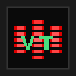

# VoxTape

<p align="center">
  
</p>

<p align="center">
  <strong>Real-time meeting transcription & AI-powered note-taking — 100% local, 100% private</strong>
</p>

<p align="center">
  <a href="https://github.com/Lingelo/VoxTape/releases"></a>
</p>

<p align="center">
  
  
  
  
  
</p>

---

A macOS desktop app for real-time meeting transcription (Teams, Meet, Zoom...) with automatic summary and key point generation. **Everything runs locally** — no external APIs, no data sent to the cloud.

## Features

- **Real-time transcription** — Simultaneous mic + system audio capture (Whisper Turbo)
- **Local AI** — Summaries, key points, action items via Ministral 3B
- **Contextual chat** — Ask questions about your past meetings
- **Bilingual** — French and English (UI, transcription, AI prompts)
- **Full-text search** — SQLite FTS5
- **Export** — Markdown or plain text
- **100% offline** — No connection required after model download

## Requirements

| Component | Minimum | Recommended |
|-----------|---------|-------------|
| **macOS** | 14.2 (Sonoma) | 15+ (Sequoia) |
| **RAM** | 16 GB | 32 GB |
| **Storage** | 10 GB | 20 GB |
| **Processor** | Apple Silicon (M1) | M2/M3/M4 |

> System audio capture requires macOS 14.2+ (ScreenCaptureKit). Intel Macs are not supported.

## Installation (Users)

1. Download the DMG from [Releases](https://github.com/Lingelo/VoxTape/releases)
2. Drag VoxTape into Applications

### Gatekeeper bypass

The app is not notarized. macOS will show "app is damaged". Run:

```bash
xattr -cr /Applications/VoxTape.app
```

### First launch

1. Open VoxTape
2. The setup wizard downloads AI models (~5 GB)
3. Grant microphone + screen recording access in System Settings

## Development

### Prerequisites

- **Node.js 20+** (recommended: [nvm](https://github.com/nvm-sh/nvm))
- **Rust** (optional, for system audio capture)
  ```bash
  curl --proto '=https' --tlsv1.2 -sSf https://sh.rustup.rs | sh
  ```

### Quick start

```bash
# Clone and install
git clone https://github.com/Lingelo/VoxTape.git
cd VoxTape
npm install

# Download AI models
npm run download-model       # STT: Silero VAD + Whisper Turbo (~540 MB)
npm run download-llm-model   # LLM: Ministral 3B Q4_K_M (~2.1 GB)

# Run in dev mode (hot-reload)
npm run dev
```

The app opens automatically. Angular dev server runs on `http://localhost:4200`.

### Commands

| Command | Description |
|---------|-------------|
| `npm run dev` | Development mode with hot-reload |
| `npm test` | Run tests (Vitest) |
| `npm run build` | Production build |
| `npm run package` | Create VoxTape.app |
| `npm run make` | Create DMG + ZIP |
| `npm run build:native` | Compile Rust native module |

## Architecture

```
┌─────────────────────────────────────────────────────────────┐
│  Electron Main Process                                      │
│  ┌───────────────────────────────────────────────────────┐  │
│  │  NestJS Backend                                       │  │
│  │  AudioModule → SttModule → stt-worker (sherpa-onnx)   │  │
│  │  LlmModule ────────────→ llm-worker (node-llama-cpp)  │  │
│  │  DatabaseModule (SQLite) | ConfigModule | ExportModule│  │
│  └───────────────────────────────────────────────────────┘  │
│  IPC Hub (contextBridge)                                    │
└─────────────────────────┬───────────────────────────────────┘
                          │
┌─────────────────────────┴───────────────────────────────────┐
│  Renderer Process (Angular 21 SPA)                          │
│  SessionService | AudioCaptureService | LlmService          │
└─────────────────────────────────────────────────────────────┘
```

### Nx monorepo layout

| Project | Stack | Description |
|---------|-------|-------------|
| `apps/electron-shell` | Electron + Vite | Main process + STT/LLM workers |
| `apps/renderer` | Angular 21 | User interface |
| `libs/backend` | NestJS 11 | Services (audio, STT, LLM, DB, export) |
| `libs/shared-types` | TypeScript | Interfaces and IPC constants |
| `libs/native-audio-capture` | Rust + napi-rs | System audio capture (ScreenCaptureKit) |

### AI Models

| Model | Size | Usage |
|-------|------|-------|
| Silero VAD | 2 MB | Voice activity detection |
| Whisper Turbo (int8) | 538 MB | Speech-to-text — large-v3-turbo distilled |
| Ministral 3B Q4_K_M | 2.1 GB | Summaries and chat |

## Contributing

1. Fork the project
2. Create a branch (`git checkout -b feature/my-feature`)
3. Commit (`git commit -m 'feat: add my feature'`)
4. Push (`git push origin feature/my-feature`)
5. Open a Pull Request

## License

MIT — See [LICENSE](LICENSE)
